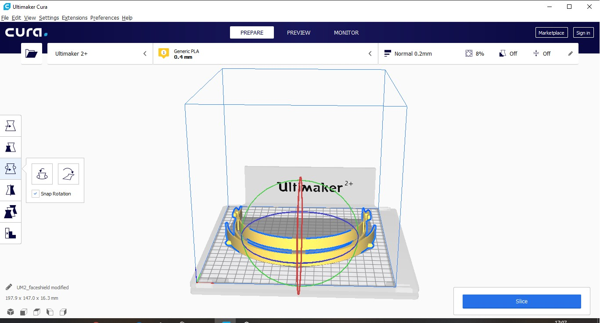
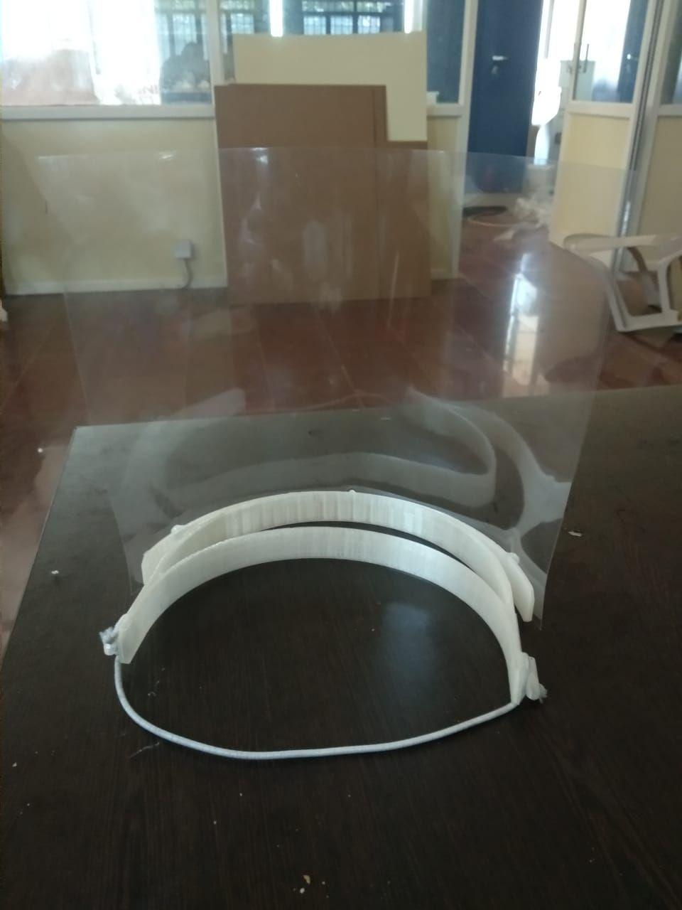

FACE SHIELD
 

This repository contains the detailed instructions and design files to Faceshield which is used as protective equipment around the world in the COVID19 situation.
Faceshield is very useful as a protective gear since it prevents the aerosols or viral effluent contact with our face. Thus prevents the spread.

The Faceshield can be fabricated using the 3D printing Technology.
Given details and designs are verified and created by us in FabLab of Govt engineering college Thrissur as part of COVID19 activities. 

FABRICATION OF FACESHIELD FRAME

1. The face shield 3D design is in repo (filename.stl )

THE design is frame which is fixed to head having an elastic band on it. The frame design is implimented with complient mechanism which allow effient amount of compression and expansion of frame without fail.

2. The design is imported in gcode converter software for 3D printing gcode creation.

    3D printer : ultimaker 2+
    material   : PLA
    Diameter   : 2.85 mm
    software   : cura Engine

orientation is set to base-flat inorder to reduce the support printing.

3. The 3d Printing parameters are given below:

   Details are as per best low time-good quality criteria satified from several conducted samples of frame.

   
   
   
   
   
    

4. The gcode file is in repo. Direct feed this .gcode file to printer to get the print.

faceshieldmodified.stl

ASSEMBLY OF FACESHIELD

